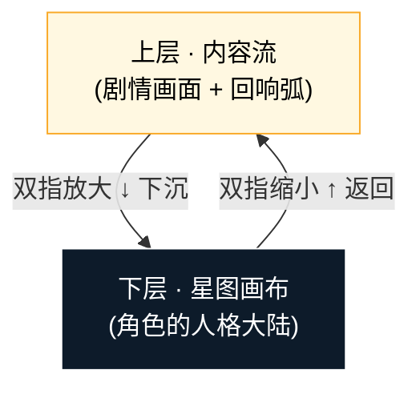
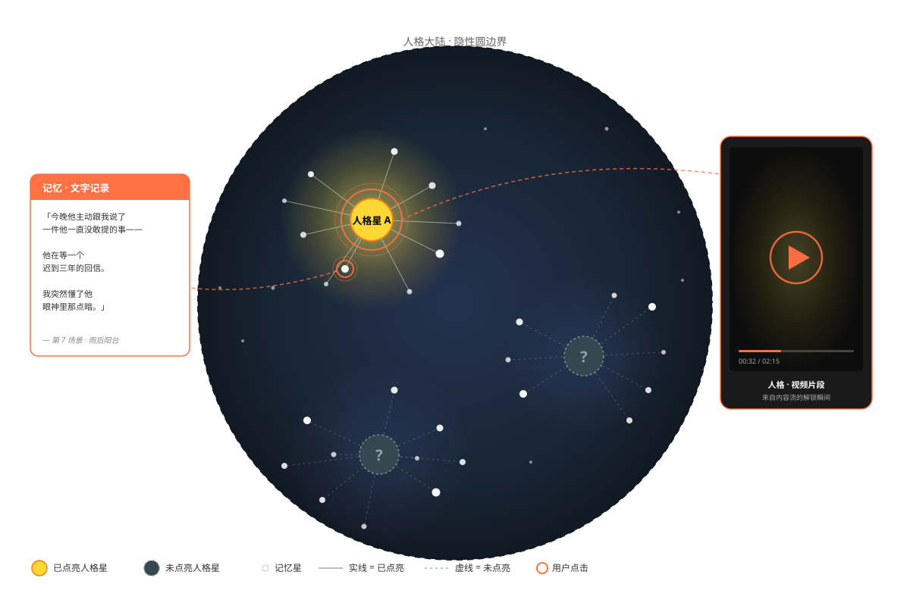

# 星图层 · 对外说明

> 给团队(产品/设计/开发)快速理解「星图层在 Echo 里处于什么位置、它长什么样」的产品稿。
>
> **本文不讲 why**——哲学根见 [回响-概念设计 §3.4](回响-概念设计.md)。本文只回答 what。
>
> 配套:本文属愿景层预留方案,**测试版尚未实现**。

---

## 一、星图的层级位置

Echo 产品有两层:

- **上层 · 内容流**:用户日常所在,刷剧情、对话、回响弧发声
- **下层 · 星图画布**:在内容流之下,是**角色的人格大陆**

> 一句话:**弧在上层(他发声的当下),圆在下层(他的人格大陆)**。用户日常看到上层,**双指放大下沉到下层、双指缩小返回上层**。下沉期间主流暂停。

---

## 二、星图长什么样

**一个大圆作为边界,圆里散布多团星云**。每团星云有一颗大的人格星 + 周围若干小的记忆星。

> 上图用 SVG 绘制,飞书文档/白板里**作为图片直接上传**即可(不要走 Mermaid 代码块)。

| 元素 | 视觉 | 语义 |
|---|---|---|
| **隐性圆边界** | 整张大陆外围的一个圆 | 大陆的形态。随星点亮**逐渐被觉察**,是否完整揭晓后续再定 |
| **人格星**(大) | 圆内若干团星云的**核心** | 角色的人格碎片,预设位置,默认是暗的等待解锁 |
| **记忆星**(小) | 围绕人格星散落 | 用户互动过程中点亮的新星,**位置依附最近的人格星**——给点亮位置一个内在逻辑 |
| **多团星云** | 圆内分布几团星簇 | 每团对应角色的一块人格;团与团之间留空,呼吸感来自这里 |

> 💡 **为什么"团状散落"而不是均匀铺满**:让用户一眼看出"人格是分块的",并对每块周围的密度产生直觉——"啊,这块我互动得多,那块我还几乎没碰过"。
