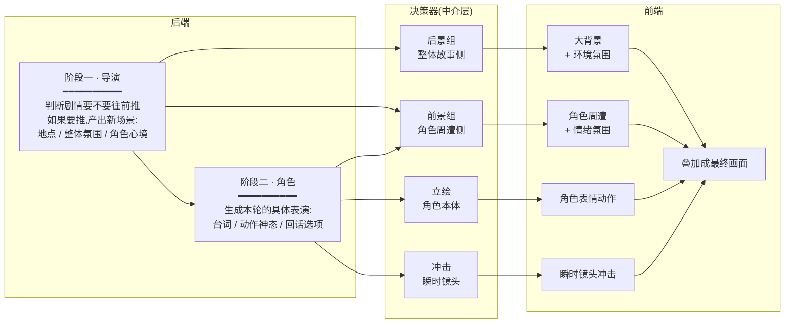
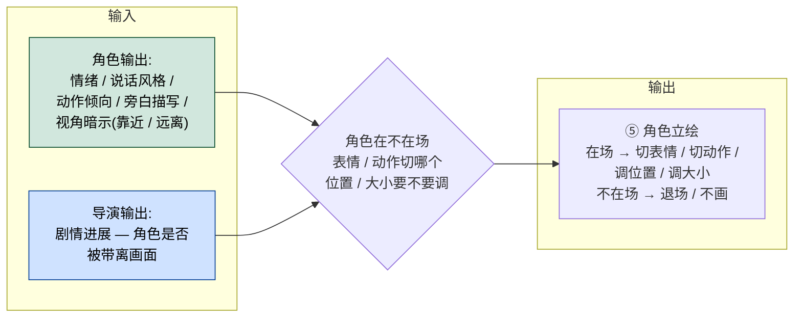
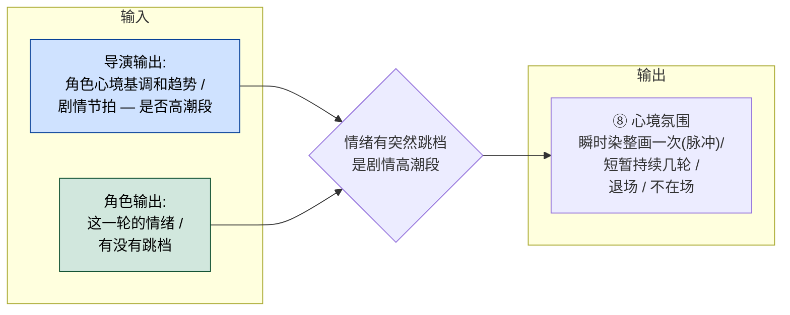
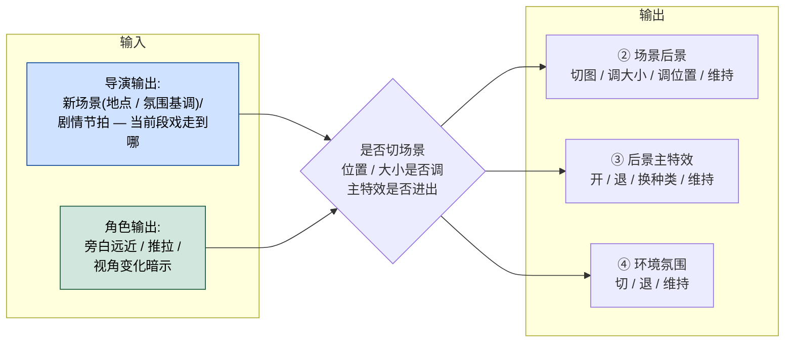
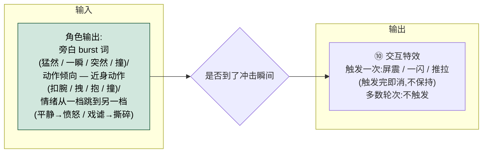

# 素材展现 · 前后端协作

> 这是一份**配合逻辑说明**:讲清楚后端和前端各自做什么、怎么衔接,不是开发方案。技术细节去 [机制.md](素材展现-机制.md);本文与下游文档不一致时,以本文为准。

---

## § 1 视觉层级 · 11 层视觉栈

从上到下的图层叠加(看到的最上面 → 最下面):

```
              ┌──────────────────────────────┐  ← 视觉最上
P0 表面层  ── │ ⑪ 交互 UI                    │
              │ ⑩ 交互特效(一闪 / 一震)     │
              │ ⑨ 文字层(旁白 / 对白)       │
              ├──────────────────────────────┤
P1 前景组  ── │ ⑧ 心境氛围(主角侧 染整画)   │
              │ ⑦ 前景主特效                 │
              │ ⑥ 场景前景(单体切图)        │
              ├──────────────────────────────┤
P2 角色    ── │ ⑤ 立绘                       │  ← 视觉中轴
              ├──────────────────────────────┤
P3 后景组  ── │ ④ 环境氛围(世界侧 染后景区) │
              │ ③ 后景主特效                 │
              │ ② 场景后景(整图遮罩或单体)  │
              ├──────────────────────────────┤
P4 底色    ── │ ① 极暗底                     │  ← 视觉最下
              └──────────────────────────────┘
```


---

## § 2 协作机制 · 一图说清



**三栏关系**:
- **后端**只产出"剧情走向 + 角色表演",不直接管画面长什么样
- **决策器**是中介:**有取舍地**从后端两阶段各取所需,翻译成前端各层要怎么变
- **前端**只负责按决策器给的指示更新画面,不操心剧情怎么走

---

## § 3 一段剧情内,每轮谁在变

下表展示一段剧情内 8 轮的典型时序——每一列是一轮,每一行是后端的一个角色或前端的一层。**只列了第一期实际会被决策器调度的 6 层**;其他层要么跟角色直出(⑪ 交互 UI / ⑨ 文字层)、要么第一期暂不做(⑥ 场景前景 / ⑦ 前景主特效)、要么永远在底(① 极暗底),本表不画。

| 角色 / 层 | 归属 | 轮 1 | 轮 2 | 轮 3 | 轮 4 | 轮 5 | 轮 6 | 轮 7 | 轮 8 → 切换 |
|---|---|:---:|:---:|:---:|:---:|:---:|:---:|:---:|:---:|
| 导演判断 | 后端 | ✓ | ✓ | ✓ | ✓ | ✓ | ✓ | ✓ | ✓ |
| 导演产新场景 | 后端 | ★ |  |  |  |  |  |  | ★ |
| 角色表演 | 后端 | ● | ● | ● | ● | ● | ● | ● | ● |
| **⑩ 交互特效** | 冲击决策器 |  |  |  | ● |  |  | ● |  |
| **⑧ 心境氛围** | 前景组决策器 |  |  | ● |  |  |  | ● |  |
| **⑤ 角色立绘** | 立绘决策器 | ● | ● | ● | ━ | ● | ● | ● | ● |
| **④ 环境氛围** | 后景组决策器 | ● | ━ |  |  |  |  |  | ★ |
| **③ 后景主特效** | 后景组决策器 | ● | ━ |  |  |  | ● | ━ |  |
| **② 场景后景** | 后景组决策器 | ● | ━ | ━ | ━ | ● | ━ | ━ | ★ |

**图例**:`✓` 每轮都判 · `★` stage 切换瞬间产出 · `●` 这一轮**变化**(出现 / 切换 / 重置) · `━` 这一轮**保持**(显式占着,跟上一轮同状态) · 空 = 这一轮该层**不在场**

---

## § 4 四个决策器的运作原理

每个决策器接收什么输入、内部怎么判、输出给前端哪些层。

**图例**:🟦 = 来自**导演输出** · 🟩 = 来自**角色输出**

### 4.1 立绘决策器



### 4.2 前景组决策器(第一期只管 ⑧ 心境氛围)



### 4.3 后景组决策器



### 4.4 冲击决策器



---

## 关联文档

- [素材展现.md](素材展现.md)(总索引,待补本文入口)
- [素材展现-速览.md](素材展现-速览.md)(3 分钟概念入口)
- [素材展现-机制.md](素材展现-机制.md)(规则手册,技术细节在这里)
- [素材展现-工作笔记.md](素材展现-工作笔记.md)(设计来由)
- [../01-通用设计规范/表现设计.md](../01-通用设计规范/表现设计.md)(11 层视觉栈口径)
