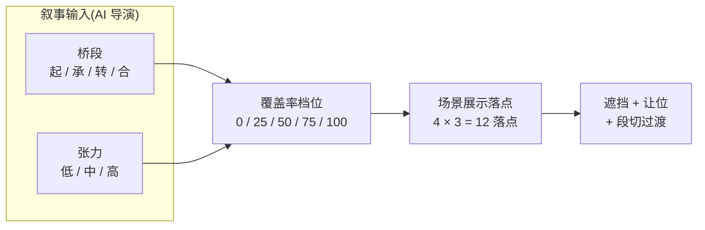

# 素材展现 · 速览

> 3 分钟读完整套机制。看完后:实现规则去 [机制.md](素材展现-机制.md);追溯设计来由去 [工作笔记.md](素材展现-工作笔记.md)。

---

## Echo 内容流是什么

Echo 是**上滑驱动的剧场化叙事载体**。每段旁白 / 对白出现后,等用户上滑才推进——**驻留时长由用户决定,不在系统控制**。

这条前提把"画面"的定义改成「每一次上滑都是一帧画面状态」,系统只管:
1. **这一帧长什么样**(画面状态)
2. **上滑那一瞬间怎么过渡**(段切动效)

不管「这一帧停留多久」(用户行为决定)。

---

## 整套机制 · 一句话

> **AI 导演**输出叙事语言(桥段 × 张力)→ **系统**按翻译表得视觉档位 → **11 层栈**按 5 分组叠出最终画面。

---

## 架构图



---

## 11 层视觉栈

从上到下的图层叠加(看到的最上面 → 最下面):

```
              ┌──────────────────────────────┐  ← 视觉最上
P0 表面层  ── │ ⑪ 交互 UI                    │
              │ ⑩ 交互特效(一闪 / 一震)     │
              │ ⑨ 文字层(旁白 / 对白)       │
              ├──────────────────────────────┤
P1 前景组  ── │ ⑧ 心境氛围(主角侧 染整画)   │
              │ ⑦ 前景主特效                 │
              │ ⑥ 场景前景(单体切图)        │
              ├──────────────────────────────┤
P2 角色    ── │ ⑤ 立绘                       │  ← 视觉中轴
              ├──────────────────────────────┤
P3 后景组  ── │ ④ 环境氛围(世界侧 染后景区) │
              │ ③ 后景主特效                 │
              │ ② 场景后景(整图遮罩或单体)  │
              ├──────────────────────────────┤
P4 底色    ── │ ① 极暗底                     │  ← 视觉最下
              └──────────────────────────────┘
```

- 跨组遮挡严格 P0 → P4
- 角色 ⑤ 是中轴,前景组在角色前,后景组在角色后
- ⑧ 心境 / ④ 环境**长开互斥**——任意时刻只一个在场,看剧情主线选

---

## 5 个设计层次 · 从总到分

> 整套机制按"先总后分"5 个层次展开:覆盖率是总指挥,接着分别决定**场景**和**角色**怎么呈现,再叠**配合的效果**(特效 / 氛围 / 动效),最后由**层级协同**保证不打架。

---

### 1 ─ 覆盖率(总指挥)

系统先决定"这一帧暴露多少世界",其他维度挂在档位之上。

- AI 导演输出(桥段, 张力)→ 系统查 4×3 表得**档位**
- 档位 5 档:留白 / 小窥 / 中窥 / 大窥 / 全揭
- 同段落内档位稳定,段落切换可跳任意档(跨度大时渐变过渡)

详见:[机制 §1 覆盖率 × 桥段](素材展现-机制.md#1-覆盖率--桥段)

---

### 2 ─ 场景的露出方式(怎么把世界画出来)

档位定了之后,场景图按**四要素**决定怎么露出:

- **形状**:正圆默认;椭圆 / 直边需附剧情语义
- **大小**:5 档,与覆盖率档位共用
- **中心点**:整画上多个合法落点(含"半框探入位",表达从侧面探入)
- **柔边**:窥探感的来源("望远镜 / 钥匙孔"感)

外加**场景层单体**(纸扎人 / 灯笼 / 鱼尾 / 食人花这类切图):
- 前后景各允许 1 个,任意时刻最多 2 个单体在场
- 单体不占覆盖率档位(独立装饰)

详见:[机制 §4 露出区域](素材展现-机制.md#4-露出区域) + [§1.6 单体规则](素材展现-机制.md#1-覆盖率--桥段)

---

### 3 ─ 角色立绘 ⑤ 的展示形式(待定)

> 🟡 **待补**:8 场样本里角色立绘默认居中,**目前未单独成规则**。
>
> 待讨论的维度:**立绘位置偏移 / 立绘缩放 / 多角色同框**——等剧本扩展到需要时再立规则。

---

### 4 ─ 配合的效果(特效 + 氛围 + 动效节奏)

场景和角色定型之后,叠上"让画面会动、有情绪"的几层。

**两层主特效**(二选一,默认全屏):
- ⑦ 前景 / ③ 后景。主特效是「场域氛围」(月光柱 / 鬼火 / 雾 / 浮粒),不走点状贴图

**两层氛围层**(长开二选一,看剧情主线):
- ⑧ 心境(主角侧 染整画)/ ④ 环境(世界侧 染后景区)
- 瞬时一闪(⑧ burst,如 red-alert)不占长开槽位

**动效节奏 三类**:
- **持续型**:立绘呼吸 / 氛围渐变 / 特效漂移的速度——与张力联动(低慢 / 高快)
- **瞬时冲击**:只在 ⑧ 心境层 + ⑩ 镜头层两处发生,其他层不闪不震
- **段切过渡**:微变 / 中变 / 大变三档时长(用户上滑触发)

详细数值表(时长 / 倍率)→ [机制 §2 动效节奏](素材展现-机制.md#2-动效节奏)

---

### 5 ─ 层级协同(谁压谁、让谁位)

11 层叠在一起难免互相打架,本节是"打架时怎么办"的规则。

- 11 层分 5 组(图示见上方),跨组遮挡严格 P0 → P4

**3 条让位规则**:
1. **文字密集段** → 氛围层透明度临时降,文字读完恢复
2. **镜头瞬时冲击** → 所有下层瞬间被压,冲击结束恢复
3. **主特效切换** → 旧淡出 → 极暗 → 新淡入,不允许两种叠加

**入场顺序不立规则**——哪些层在场、何时入场由 AI 导演按剧本决定。

详见:[机制 §3 层级协同](素材展现-机制.md#3-层级协同)

---

## 场景覆盖率表速看

| 桥段 \ 张力 | 低 | 中 | 高 |
|---|---|---|---|
| **起** | 0 | 25 | 50 |
| **承** | 25 | 50 | 75 |
| **转** | 50 | 75 | 100 |
| **合** | 25 | 50 | 75 |

- "桥段"告诉系统**这段在做什么**(铺垫 / 推进 / 冲击 / 收束)
- "张力"告诉系统**做到什么程度**(轻 / 中 / 用力)
- AI 不直接说"覆盖率 50%",只说"承 / 中",剩下系统翻译

---

## 关键前提(读规则前必知)

1. **段落驻留时长不在系统控制中** —— 所以本规则集**不立**「留白 ≤ Xs / 静止 ≤ Xs」一类硬约束
2. **桥段 ≠ 档位** —— 同一桥段可走不同档位组合;翻译表是中介层
3. **AI 导演只说人话** —— AI 输出"承 / 中"这种叙事词,不输出"透明度 / 混合模式"这种数值;翻译由系统包办
4. **入场顺序不在规则里** —— 哪些层在场、什么时机入场,由 AI 导演按剧本决定;系统只保证「同时在场时」的遮挡 + 让位

---

## 关联文档

- 上游:[../01-通用设计规范/表现设计.md](../01-通用设计规范/表现设计.md)(11 层栈 / 画面声明 DSL)
- 同级:[分场层级.md](分场层级.md)(8 场策略)、[素材清单.md](素材清单.md)、[节奏起伏.html](节奏起伏.html)
