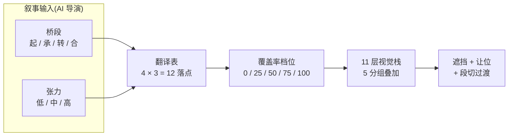

# 测试版 · 素材展现

> Echo 测试版的素材展现规则集,共四维度 17 条子规则已敲定。本文件是入口索引——正文已按读者意图拆为三份。

---

## 想做什么?

| 目的 | 看这份 | 预估时间 |
|---|---|---|
| 3 分钟搞清"Echo 怎么把剧本变画面的" | [素材展现-速览.md](素材展现-速览.md) | 3-5 分钟 |
| 照规则实现 / 定义新场 | [素材展现-机制.md](素材展现-机制.md) | 15-20 分钟 |
| 追溯"为什么是这条规则" | [素材展现-工作笔记.md](素材展现-工作笔记.md) | 30 分钟+ |

---

## 核心架构(一图速览)

> **AI 导演**输出叙事语言(桥段 × 张力)→ **系统**按翻译表得视觉档位 → **11 层栈**按 5 分组叠出最终画面。

---

## 关键前提

Echo 推进 = 用户上滑驱动,**段落驻留时长不在系统控制中**。本规则集**不立**「留白 ≤ Xs / 静止 ≤ Xs」一类硬约束。系统只管「画面状态」+「段切过渡」,不管「停留多久」。

---

## 关联文档

- 上游:[../01-通用设计规范/表现设计.md](../01-通用设计规范/表现设计.md)(11 层栈 / 覆盖率口径 / 画面声明 DSL)
- 同级:[分场层级.md](分场层级.md)(8 场策略)、[素材清单.md](素材清单.md)(资产评估)、[氛围预设表.md](氛围预设表.md)、[节奏起伏.html](节奏起伏.html)
